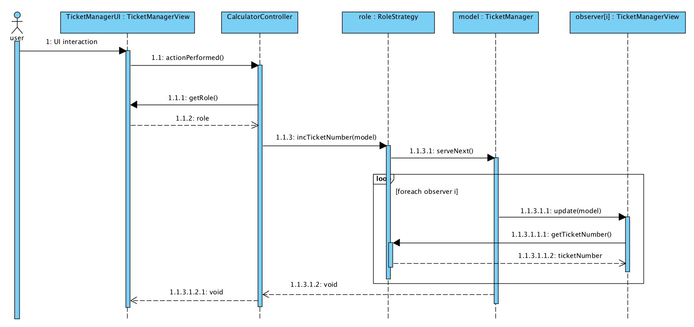

# Corso di Ingegneria del Software a.a. 2017/18

## Laboratorio 10 - Prova in itinere III

### Processo

Dopo aver formato i gruppi, gli studenti eseguono i seguenti passi:

* effettuare un **clone** del repository con comando `git clone`, sulla propria macchina;
* implementare secondo la metodologia **TDD** la specifica dei requisiti; in maggior dettaglio, ripetere il ciclo (`ROSSO` + `VERDE` + `REFACTORING`) fino ad esaurimento delle funzionalità richieste;
* durante lo sviluppo del software tracciare la storia dei cambiamenti ad ogni fase del ciclo **TDD** effettuando gli opportuni *commit* (usando `git add` e `git commit`) e iniziando il messaggio di commit rispettivamente con la stringa `ROSSO:`, `VERDE:`, oppure `REFACTORING:`;
* effettuare un push dei passi svolti su GitHub con `git push origin master`.

Al termine del laboratorio effettuare un ultimo *push* e verificare su GitHub che ci sia la completa traccia di *commit* effettuati.
Si suggerisce di eseguire i test non soltanto con Eclipse, ma anche eseguendo `./gradlew test` da riga di comando.


## Specifica dei requisiti

Obiettivo dell'esercizio è progettare e realizzare (secondo la **metodologia TDD** e facendo uso di opportuni **design pattern**) una gerarchia di classi
atte a produrre un semplice programma Java che si occupa di supportare *clienti* (Customer) e *impiegati* (OfficeWorker)
di un negozio nella gestione della *coda* (unica) alla cassa.
In particolare i clienti vengono serviti in modo FIFO in base al numero di *biglietto* (Ticket) assegnato.
Ogni cliente, quando arriva alla cassa chiede al sistema (attraverso una particolare vista) un nuovo biglietto.
I cassieri, prima di servire, chiedono al sistema (attraverso una particolare vista) il numero da servire, ovvero il prossimo numero in coda.
Un'ulteriore vista mostra sempre il numero di biglietto correntemente servito.

Il sistema deve poter funzionare con *N* (grande a piacere) viste per clienti ed *M* (grande  piacere) viste per cassieri.
Tutte le viste devono essere coordinate sul numero di biglietto da *servire* e da *erogare*.

Per semplicità, assumiamo che le operazioni degli utenti vengano eseguite in modo *atomico*, 
non è richiesto di occuparsi di problemi di *sincronizzazione*.

Il progetto deve tener conto dei seguenti requisiti:

*  Le viste associate a *clienti* e *impiegati* sono realizzate tramite la classe [TicketManagerUI](src/main/java/it/uniupo/disit/se/lab10/view/TicketManagerUI.java). Attraverso un [JButton](https://docs.oracle.com/javase/8/docs/api/javax/swing/JButton.html) e un [JLabel](https://docs.oracle.com/javase/8/docs/api/javax/swing/JLabel.html) ci permettono di richiedere e di leggere il prossimo numero di *biglietto*. Parte del comportamento delle istanze di TicketManagerUI è definito dalla strategia ([RoleStrategy](src/main/java/it/uniupo/disit/se/lab10/view/RoleStrategy.java)) passata al cotruttore.

*  Un'ulteriore vista ([DisplayUI](src/main/java/it/uniupo/disit/se/lab10/view/DisplayUI.java)), contiene solamente  un [JLabel](https://docs.oracle.com/javase/8/docs/api/javax/swing/JLabel.html) e consente di leggere il numero correntemente servito. 

*  Tutte le viste devono essere in grado di *osservare* un cambiamento nello stato del `Model`, ovvero i biglietti (erogati/serviti).
   Le viste di tipo `TicketManagerUI` inizializzate con strategia *cliente* mostrano sempre, attraverso il *label* il messaggio: `ticket: T`, dove `T` è il numero dell'ultimo ticket erogato.
   Le viste di tipo `TicketManagerUI` inizializzate con strategia *impiegato* mostrano sempre, attraverso il *label* il messaggio: `ticket: T`, dove `T` è il numero dell'ultimo ticket servito.
   Le vista di tipo `DisplayUI` mostra sempre il messaggio: `currently served: T`, dove `T` è il numero dell'ultimo ticket servito.

*  La componente [Model](src/main/java/it/uniupo/disit/se/lab10/model/Model.java) si occupa di mantenere i dati riguardanti i Ticket da erogare/servire. E' unica e comune a tutte le viste. Il `Model` a fronte di un cambiamento di stato, deve occuparsi di *notificare* tutte le viste.

* Il [Controller](src/main/java/it/uniupo/disit/se/lab10/controller/AbstractController.java) reagisce all’input dell’utente (pressione di un bottone) e richiama le operazioni opportune (definite dalla View tramite una strategia) sul `Model`.


* Lo svolgimento dell'esercizio richiede l'uso del *compound pattern* [Model View Controller (MVC)](https://en.wikipedia.org/wiki/Model%E2%80%93view%E2%80%93controller).

Un esempio di interazione tra le componenti sopra descritte può essere visualizzata graficamente tramite il seguente **Sequence diagram**, presente anche all'interno della directory [main/resources](src/main/resources) sia come file sorgente di *Visual Paradigm* sia come immagine PNG.



## Verifica e Convalida

### Test di integrazione

All'interno della directory [integrationTest](src/integrationTest) sono presenti alcuni test, il cui scopo è stimolare l'interazione tra più componenti software per verificare il corretto funzionamento dell'intero sistema (l'MVC). Questi test costituiscono i **test di accettazione** che devono passare al termine della realizzazione del software richiesto.

### Code coverage

Al termine della realizzazione del prodotto software, il gruppo utilizza il framework *JaCoCo* per ricavare le informazioni sulla copertura.
Nello specifico, occorre garantire un'elevata percentuale di **copertura** del codice per stimolare l'esecuzione di tutte le porzioni potenzialmente difettose.
E' richiesto almeno il 95% di copertura sia delle **istruzioni** sia delle **decisioni** nelle varie classi sviluppate.
Durante la scrittura dei test, occorre prestare particolare attenzione ai campi di variabilità dei dati in input per individuazione le opportune **classi di equivalenza**.

Ottenere il report sulla copertura invocando il comando
```
./gradlew clean build jacocoTestReport
```
dopodiché, il report può essere visualizzato aprendo il file `build/reports/jacoco/test/html/index.html`.


### Test double (facoltativo)

All'interno del progetto è resa disponibile la libreria [Mockito](http://site.mockito.org/) per effettuare *test double* in assenza di alcune componenti non ancora implementate.
L'uso della libreria costituisce una parte facoltativa dell'esercitazione che concederà un punteggio bonus.
